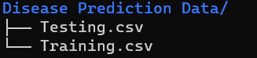

# Disease prediction machine learning project
## Overview
In this project, we aim to develop a classification model to make the work of physicians easier when predicting and or diagnosing diseases in their patients.

## Dataset
> **TLDR**   
> `132` symptoms mapped to `42` diseases
> Download dataset [here](https://www.kaggle.com/datasets/marslinoedward/disease-prediction-data/download?datasetVersionNumber=1)

The dataset used in this project consists of 133 columns. Of which `132` represents common symptoms to diseases, and a column representing the prognosis of `42` different diseases. The dataset consists of a train and test set.   
You can download the dataset [here](https://www.kaggle.com/datasets/marslinoedward/disease-prediction-data/download?datasetVersionNumber=1) on kaggle. After download extract the dataset folder to the same directory as `model.ipynb` file. Directory structure should be as shown below:

## Approach
- **Load training dataset and preprocess:** Load dataset from disk, preprocess the data and split into feature matrix(X) and labels(y).
- **Model training and selection:** Train several classifieers on the training dataset and select the best.
- **Best model evaluation:** Evaluate the best model on the test set.
- **Save best model to disk:**: Save best model to disk for later use.

## Final work
- View `model.ipynb` to see how the final model was built
- To use the final model without training:
    - Load `label_encoder.pickle.gz` and `best_estimator.pickle.gz` with `joblib`.
    - Make predictions using the loaded best estimator and reverse transform the prediction using the loaded label encoder to get the name of the disease.
