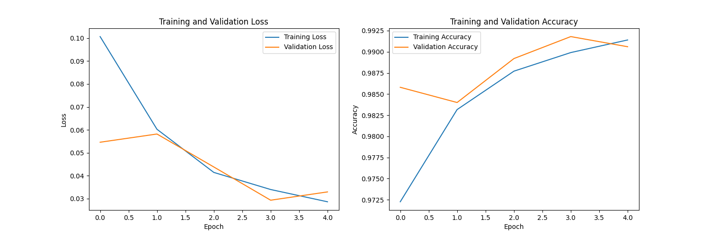

## Build an MNIST model using the RESNET-34 ARCH

### Overview
In this project, the main aim is to build the `RESNET` Convolutional Neural Network Architecture (The 34-Nets Variant). To see the power of this architecture, we would need to train some data on it, to not make things to complex I choose the MNIST dataset for this project. Even though a much simpler network would give us the same performance obtained below, the goal of this project isn't to train a model on the MNIST dataset but to construct the `RESNET` Architecture. You can read more on the architecture [here](https://arxiv.org/abs/1512.03385).

### Approach
+ Load and preprocess the MNIST dataset using tensorflow-keras
+ Build the implement the RESNET-34
+ Train the model on the dataset
+ Evaluate the model

### Model metrics
