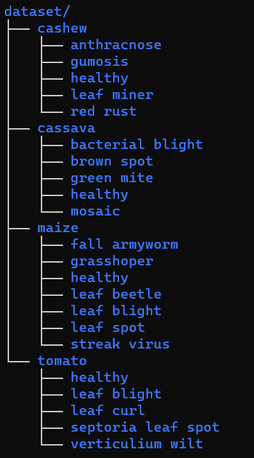

# Crop pest and disease detection
---

> **Python version**: 3.10.12   
> **Framework**: Tensorflow  
> **Libraries version**: Check `requirements.txt`

## Overview
In this project, we aim to develop a Convolutional nueral networks model to detect and predict pest and disease infection of a set of crops based on images fed to the model. The primary objective is to control pest/disease infection in order to improve crop yield.

## Dataset
[Download the dataset here](https://www.kaggle.com/datasets/nirmalsankalana/crop-pest-and-disease-detection?rvi=1)   
The dataset used in this project consists of 24,881 raw images of crops, both healthy and disease or pest infected, grouped into different classes. The crops we will be looking at include `Cashew(6,549 images)`, `Cassave(7,508 images)`, `Maize(5,389 images)` and `Tomato(5,435)`. Some diseases/pest infections are common among some.   

After downloading the dataset restructure your directory to look like I have mine (I might provide a script to do this automatically, at the time of writing there is none available).

## Approach
- **Data loading and preparation**: Read all images from disk, associating each with their correct labels. Split into train, test and validation sets. Preprocess the different sets and perform some data augmentation to the train set if necessary.
- **Model selection**: Build a ResNet-34 convolutional neural network for predicting the crops and their health/infection status.
- **Training and evaluation**: Train the network on the training set, testing different parameters that work and final evaluate it on the test set.